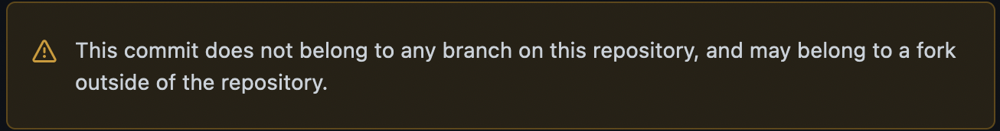

# How to organise ROS workspaces using vsctool

---

## What is vsctool?

- Version Control System tool
- Given a yaml file of repositories, vsctool clones all the repos into a target directory/directories
- Used by ROS to install ROS2/ROS Noetic from source \[[1](https://docs.ros.org/en/rolling/Installation/Ubuntu-Development-Setup.html#get-ros-2-code)\]

---

## Why not use submodules?
- Submodules are great if used properly but they're an advanced git feature
  - In shared repos, it's not fair to expect everyone to have an advanced knowledge of git
---

## Why not use submodules?
- Submodules add a link to a detached head if you don't specify a branch.
  - A detached head does not belong to any branch
---

## Why not use submodules?
- When you commit to a detached head your commit is a floating head that will cause you headaches such as this:

---

- Detached heads can be useful.
  - You often don't want to track main in an external repo in case someone commits something that breaks your code.
  - You want a known working snapshot

---

## Why not use submodules?
- Nested submodules in detached head states are an extra layer of excrement you don't want to dump onto your future self or others
